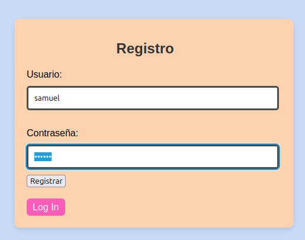
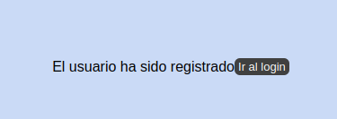
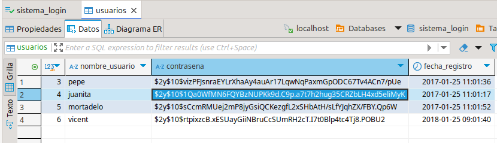
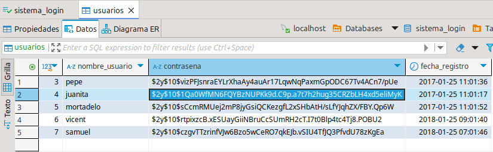
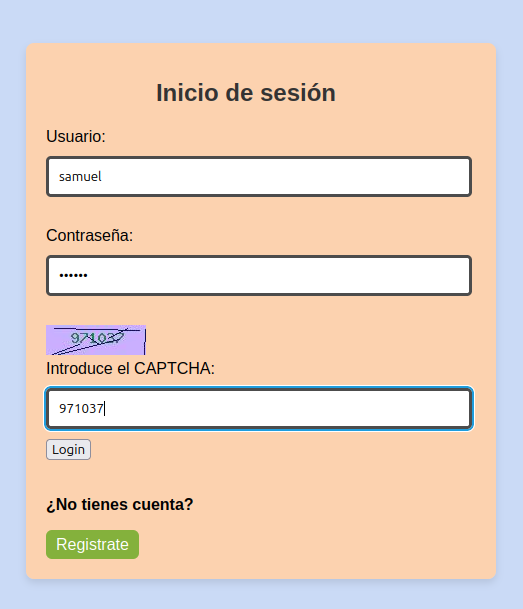
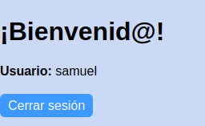
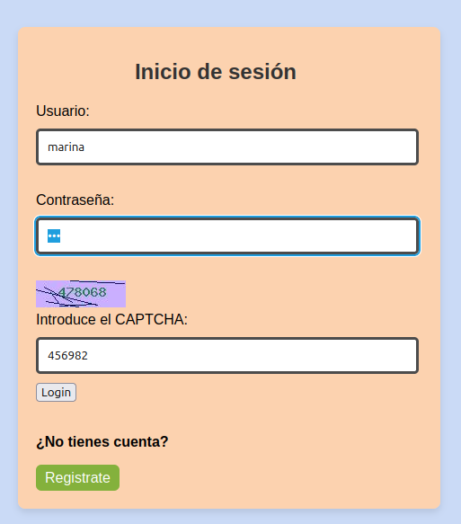
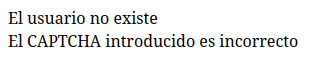

# Proyecto Final

## Actividad a realizar

El objetivo de esta actividad es que desarrolles un sistema funcional de login y registro de usuarios en PHP utilizando MySQLi. Pondrás en práctica conceptos de seguridad, validación de datos, manejo de sesiones y generación de CAPTCHA para garantizar la funcionalidad y protección del sistema.

## Estructura
Las páginas principales són:

* Inicio de sesión
* Registro
* Bienvenida

## Funcionamiento

* Registro de usuarios

* Inició de sesión de dicho usuario

* Funcionamiento del CAPTCHA

