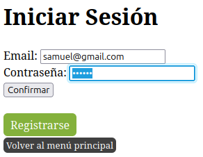

# Proyecto de Navidad

## Actividad a realizar
Implementar un sistema de autenticación de usuarios con sesiones utilizando PHP

Descripción

* Crear una base de datos:
    * Diseñar una base de datos MySQL para almacenar la información de los usuarios.
* Formulario de Registro:
    * Crear un formulario en HTML para que los usuarios puedan registrarse.
* Validación y Almacenamiento:
    * Utilizar PHP para validar los datos del formulario y almacenarlos en la base de datos.
* Formulario de Inicio de Sesión:
    * Crear un formulario de inicio de sesión en HTML.
* Autenticación:
    * Utilizar PHP para verificar las credenciales del usuario y permitir el acceso a una página protegida.
* Control de Sesiones:
    * Implementar el manejo de sesiones en PHP para mantener al usuario autenticado.

## Estructura
Tengo una página principal donde podemos registrar nuevos usuario y/o iniciar sesión.

Luego un formulario donde podemos registrar a nuevos usuario a la base de datos.Con un botón que te redirije al inicio de sesión y otro a la página principal.

Después de haber registrado a los usuarios tengo un formulario para iniciar sesión con alguno de los usuario registrados. Con un botón que te redirije al registro de usuarios y otro a la página principal.

Está la página de bienvenida a los usuarios que han iniciado sesión con un botón para cerrar sesión y volver al inicio de sesión.

-----------------------------
## Funcionamiento
Añadimos a "samuel" a nuestra base de datos.

Iniciamos sesión con el usuario "samuel" que acabamos de registrar.

 

quero subir esto pero ya

